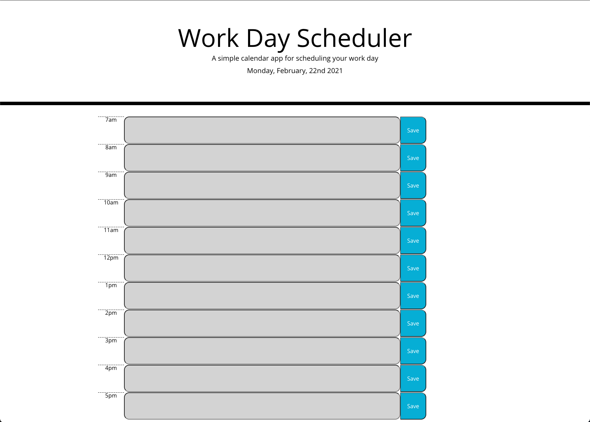

# dayplanner

Hello. This day planner app allows you to see the current date upon loading the page. Each hour time block allows you to enter any text you want and it saves it to the local storage and will stay even if you refresh the page. Gray time slots signify the past, red signifies the current hours, and green signifies the future. 

https://github.com/tuckerpikula/dayplanner

